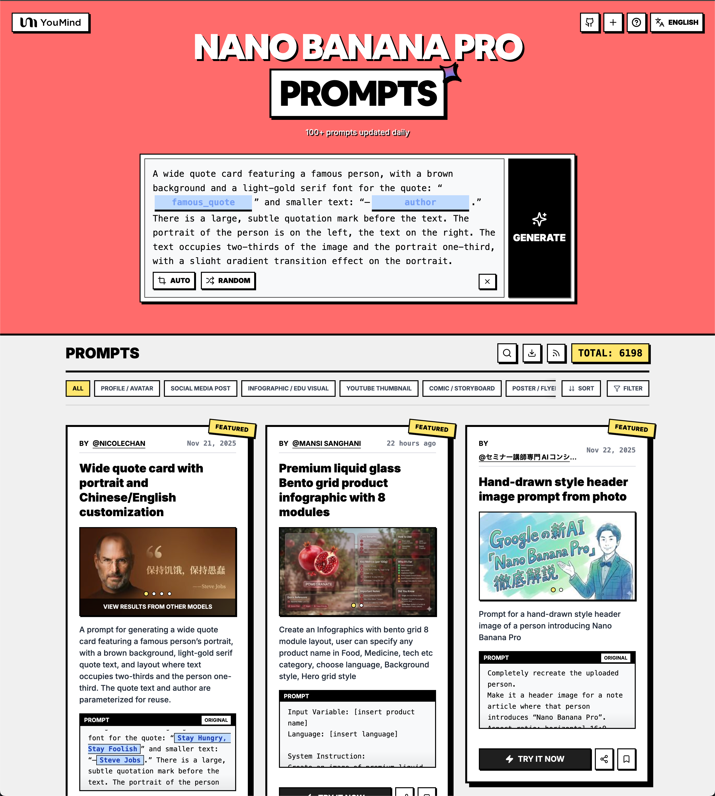

# AI图像提示词推荐器 — 10,000+ Nano Banana Pro 提示词

[](https://youmind.com/nano-banana-pro-prompts?utm_source=nano-banana-pro-prompts-recommend)
[](https://clawhub.com/skill/nano-banana-pro-prompts-recommend)
[](https://github.com/YouMind-OpenLab/nano-banana-pro-prompts-recommend-skill)
[]()
[]()
[](LICENSE)

> **停止浪费数小时寻找合适的AI图像提示词。** 用一句话告诉你的AI助手你需要什么 — 它会搜索10,000+个精选的Nano Banana Pro提示词，返回前3个匹配项并附带示例图片，可直接使用。

> 🖼️ [浏览提示词库 →](https://youmind.com/nano-banana-pro-prompts?utm_source=nano-banana-pro-prompts-recommend)



## 这是做什么用的？

这是一个**AI智能体技能**，为Claude、OpenClaw、Cursor和其他AI助手提供智能搜索精选库中**10,000+个 Nano Banana Pro（Gemini图像模型）提示词**的能力，为您的用例推荐最佳匹配，甚至可以根据您的内容自定义提示词。

**Nano Banana Pro**是Google的Gemini图像生成模型 — 今天最强大的AI图像生成器之一。高质量的提示词是获得优秀结果的关键。

## 为什么使用这个技能？

- ✅ **10,000+提示词，按用例分类** — 不是随机堆砌，而是专业分类
- ✅ **每个提示词都包含示例图片** — 复制前可以看到效果
- ✅ **智能语义搜索** — 描述您需要什么，AI会找到匹配项
- ✅ **内容混音模式** — 粘贴您的文章或视频脚本，获得自定义提示词
- ✅ **每日更新两次** — 始终反映社区最新的热门提示词
- ✅ **多语言支持** — 用您的语言回复，始终提供英文提示词用于生成

---

## 安装

### OpenClaw（推荐）

```bash
clawhub install nano-banana-pro-prompts-recommend
```

或在OpenClaw聊天中搜索：

> "从clawhub安装nano banana pro提示词技能"

### Claude Code

```bash
npx skills i YouMind-OpenLab/nano-banana-pro-prompts-recommend-skill
```

### 其他AI助手（Cursor、Codex、Gemini CLI、Windsurf）

```bash
# 通用安装程序 — 自动检测您的AI助手
npx skills i YouMind-OpenLab/nano-banana-pro-prompts-recommend-skill
```

### 手动 / openskills

```bash
npx openskills install YouMind-OpenLab/nano-banana-pro-prompts-recommend-skill
```

---

## 如何使用

### 模式1：直接搜索

只需描述您的需求：

```
"为我找一个赛博朋克风格的头像提示词"
"我需要旅行博客文章封面的提示词"
"寻找白色背景的产品照片提示词"
"帮我为科技评测视频找一个YouTube缩略图"
```

您将获得最多3个推荐，包含：
- 翻译的标题和描述（用您的语言）
- 可复制的英文提示词
- 预览风格的示例图片
- 是否需要参考图片

### 模式2：内容插图（混音）

粘贴您的内容并要求匹配的插图：

```
"这是我关于创业失败的文章 — 帮我创建封面图片：
[粘贴文章内容]"

"我需要这个视频脚本的缩略图：[粘贴脚本]"

"为这个关于AI的播客集数生成插图：[粘贴笔记]"
```

技能会：
1. 推荐匹配的风格模板
2. 询问几个问题来个性化（性别、情绪、场景）
3. 生成基于您内容的定制提示词

---

## 提示词分类

| 分类 | 数量 | 用例 |
|------|------|------|
| 社交媒体帖子 | 10,000+ | Instagram、Twitter/X、Facebook、热门内容 |
| 产品营销 | 3600+ | 广告、活动、推广材料 |
| 头像 / 资料 | 1000+ | 头像、资料照、角色肖像 |
| 其他 / 混合 | 900+ | 未分类的创意提示词 |
| 海报 / 传单 | 470+ | 活动、公告、横幅 |
| 信息图 | 450+ | 数据可视化、教育内容 |
| 电商 | 370+ | 产品照片、商品、白色背景 |
| 游戏资源 | 370+ | 精灵、角色、物品 |
| 漫画 / 分镜 | 280+ | 漫画、分镜、连续艺术 |
| YouTube缩略图 | 170+ | 点击吸引人的视频封面 |
| 应用 / 网页设计 | 160+ | UI模型、界面设计 |

---

## 工作原理

```
用户描述需求
      ↓
技能从关键词信号识别分类
      ↓
搜索匹配的JSON文件（令牌高效的grep，从不加载完整文件）
      ↓
返回前3个提示词与图片+翻译的描述
      ↓
[可选] 用户选择一个 → 技能将其混音以匹配其内容
```

**令牌效率设计**：技能从不加载完整的分类文件。使用grep式搜索只提取匹配的提示词，即使在库中有10,000+提示词时也能保持令牌使用量最小。

---

## 数据来源

提示词来自Twitter/X上顶级AI艺术家的热门帖子，通过GitHub Actions**每日同步两次**自动同步到此库。库持续增长。

*提示词由 [YouMind.com](https://youmind.com?utm_source=nano-banana-pro-prompts-recommend) 通过公开社区搜集 ❤️*
*Prompts curated from the open community by [YouMind.com](https://youmind.com?utm_source=nano-banana-pro-prompts-recommend)*

---

## 常见问题

**问：什么是Nano Banana Pro？**
Nano Banana Pro是Google的Gemini图像生成模型（模型ID：`gemini-3-pro-image-preview`）。它从文本提示词生成高质量、逼真和艺术性的图像。[在YouMind上尝试 →](https://youmind.com/nano-banana-pro-prompts?utm_source=nano-banana-pro-prompts-recommend)

**问：使用此技能需要YouMind账户吗？**
不需要。该技能完全免费，适用于任何支持自定义技能的AI助手（OpenClaw、Claude Code、Cursor、Codex、Gemini CLI）。您只有在想在youmind.com上直接生成图像时才需要YouMind账户。

**问：这与在Twitter上搜索提示词有什么不同？**
库按用例预先筛选和分类 — 您不必在噪音中滚动。每个提示词都包含示例图片，您知道会得到什么。混音模式可以根据您的具体内容个性化模板。

**问：我可以贡献提示词吗？**
可以！提示词来自公开的YouMind社区。在[YouMind](https://youmind.com/nano-banana-pro-prompts?utm_source=nano-banana-pro-prompts-recommend)分享您的Nano Banana Pro创作，它们将在下一次同步中被收录。

**问：库多久更新一次？**
通过GitHub Actions每日更新两次（00:00和12:00 UTC）。

**问：这对其他图像生成模型也有效吗？**
提示词针对Nano Banana Pro（Gemini）优化，但许多其他模型如GPT Image、Seedream和DALL-E只需少量调整即可正常工作。

**问：OpenClaw和Claude Code安装有什么区别？**
OpenClaw使用`clawhub install`命令并直接集成到您的OpenClaw智能体工作空间。Claude Code使用`npx skills i`并安装到您的Claude项目上下文中。两者都使用相同的SKILL.md和提示词库。

---

## 项目结构

```
nano-banana-pro-prompts-recommend-skill/
├── SKILL.md                 # 技能说明（适用于OpenClaw、Claude Code、Cursor等）
├── README.md
├── package.json
├── scripts/
│   └── generate-references.ts   # 从CMS获取和分类提示词
├── references/              # 自动生成的提示词数据（每日更新两次）
│   ├── social-media-post.json
│   ├── product-marketing.json
│   ├── profile-avatar.json
│   ├── {其他分类}.json
│   └── others.json
└── .github/workflows/
    └── generate-references.yml  # 计划同步任务
```

---

## 开发

### 前置条件

- Node.js 20+
- pnpm

### 设置

```bash
pnpm install

# 用CMS凭据创建.env
echo "CMS_HOST=your_host" >> .env
echo "CMS_API_KEY=your_key" >> .env

# 生成参考资料
pnpm run generate
```

### GitHub Actions 机密

| 机密 | 描述 |
|------|------|
| `CMS_HOST` | PayloadCMS API主机 |
| `CMS_API_KEY` | PayloadCMS API密钥 |

---

## 相关项目

- 🍌 [awesome-nano-banana-pro-prompts](https://github.com/YouMind-OpenLab/awesome-nano-banana-pro-prompts) — 完整提示词库，包含10,000+条目，16种语言
- 🎬 [awesome-seedance-2-prompts](https://github.com/YouMind-OpenLab/awesome-seedance-2-prompts) — Seedance 2.0的精选视频生成提示词
- 🖼️ [YouMind Nano Banana Pro Gallery](https://youmind.com/nano-banana-pro-prompts?utm_source=nano-banana-pro-prompts-recommend) — 在线浏览和生成

## 相关工具

- [OpenClaw](https://openclaw.ai) — 带有技能生态系统的AI智能体平台
- [ClawHub](https://clawhub.com) — OpenClaw技能市场
- [skills CLI](https://www.npmjs.com/package/skills) — 通用AI技能安装程序
- [openskills](https://github.com/nicepkg/openskills) — 多智能体技能加载器

---

## 许可证

MIT © [YouMind](https://youmind.com?utm_source=nano-banana-pro-prompts-recommend)